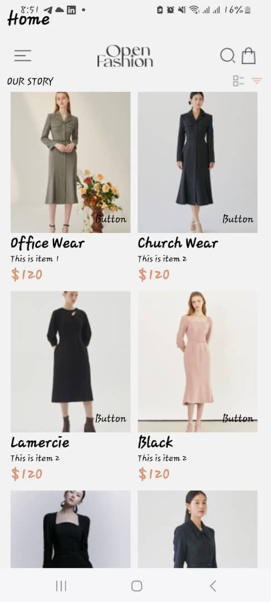
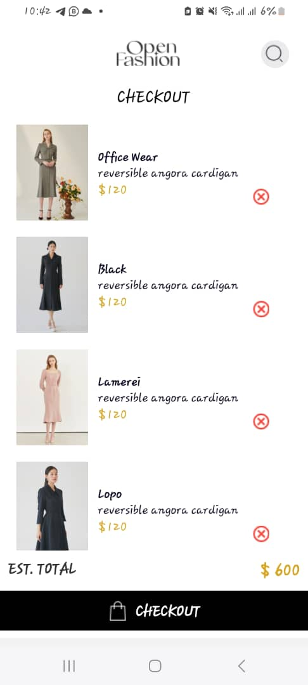

# Project Overview

This project is a mobile application designed for an e-commerce platform. It allows users to browse products, add them to their cart, and view their cart contents before checkout. The application is built using React Native, enabling it to run on both iOS and Android devices.

## Key Features

- **Home Screen:** Displays a list of products that users can add to their cart. It includes a custom navigation bar (`SmallBar`) with links to the cart and other sections of the app.
  
- **Product Cards:** Each product is displayed as a card (`Card`) with an image, name, info, and price. Users can add products to their cart directly from these cards.
  
- **Cart Screen:** Users can view all items they've added to their cart (`Checkout`). It fetches cart items from local storage and displays them in a list.
  
- **Navigation:** The app uses React Navigation for navigating between the home screen and the cart screen.

## Technical Details

### Libraries and Frameworks

- **React Native:** Used for building the mobile application.
  
- **React Navigation:** Manages navigation between different screens of the app.
  
- **AsyncStorage:** Used for storing cart items locally on the device.

### Components

- **App.js:** The root component that sets up the navigation stack.
  
- **Home.js:** Displays the home screen with a list of products.
  
- **Checkout.js:** Manages the cart screen, displaying items added to the cart.
  
- **Card.js:** Represents a single product card.
  
- **SmallBar.js:** A custom navigation bar displayed on the home screen.
  
- **Button.js:** A reusable button component used for adding items to the cart.
  
- **Data.js:** Contains the data for the products displayed in the app.

### Styles

The application uses StyleSheet for styling components. Each component has its styles defined in the same file for ease of maintenance.

## Setup and Running

To run this project, you need to have React Native environment set up on your machine. After cloning the project, navigate to the project directory and run:

Screenshots

# Project Overview

This project is a mobile application designed for an e-commerce platform. It allows users to browse products, add them to their cart, and view their cart contents before checkout. The application is built using React Native, enabling it to run on both iOS and Android devices.

## Key Features

- **Home Screen:** Displays a list of products that users can add to their cart. It includes a custom navigation bar (`SmallBar`) with links to the cart and other sections of the app.
  
- **Product Cards:** Each product is displayed as a card (`Card`) with an image, name, info, and price. Users can add products to their cart directly from these cards.
  
- **Cart Screen:** Users can view all items they've added to their cart (`Checkout`). It fetches cart items from local storage and displays them in a list.
  
- **Navigation:** The app uses React Navigation for navigating between the home screen and the cart screen.

## Technical Details

### Libraries and Frameworks

- **React Native:** Used for building the mobile application.
  
- **React Navigation:** Manages navigation between different screens of the app.
  
- **AsyncStorage:** Used for storing cart items locally on the device.

### Components

- **App.js:** The root component that sets up the navigation stack.
  
- **Home.js:** Displays the home screen with a list of products.
  
- **Checkout.js:** Manages the cart screen, displaying items added to the cart.
  
- **Card.js:** Represents a single product card.
  
- **SmallBar.js:** A custom navigation bar displayed on the home screen.
  
- **Button.js:** A reusable button component used for adding items to the cart.
  
- **Data.js:** Contains the data for the products displayed in the app.

### Styles

The application uses StyleSheet for styling components. Each component has its styles defined in the same file for ease of maintenance.

## Setup and Running

To run this project, you need to have React Native environment set up on your machine. After cloning the project, navigate to the project directory and run:

